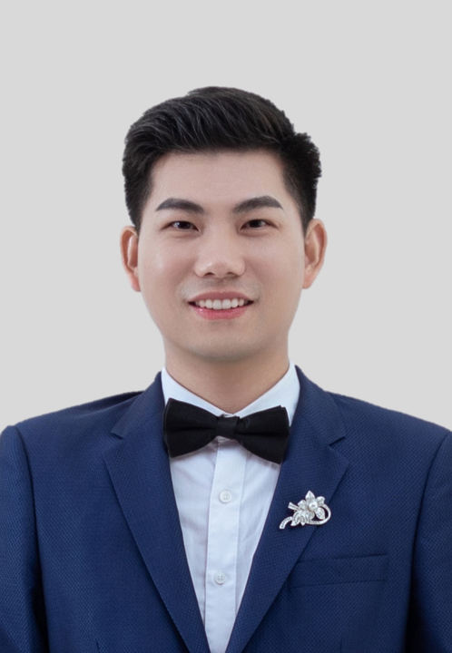

Chao Yang graduated from the School of Machinery and Automation at Wuhan University of Science and Technology with the B.Eng. degree in 2016 and the M.Eng. degree in 2019. 

He is currently working as an engineer at the Shenzhen Institute of Artificial Intelligence and Robotics for Society (AIRS), focusing on deep learning research in the areas of video, imagery, and point cloud technology.